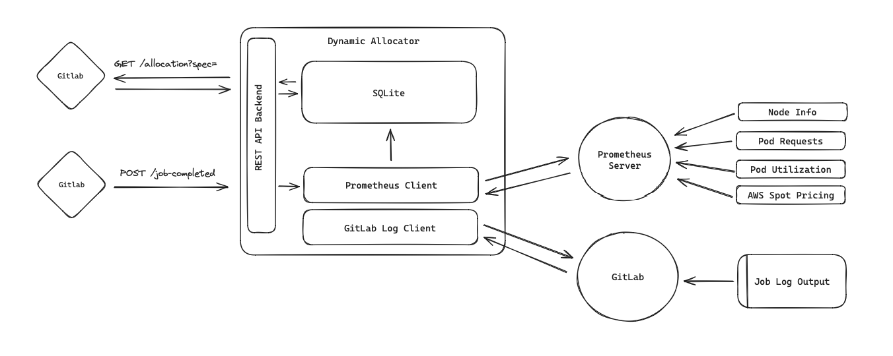

# Architecture

**To implement**:
- GitLab webhooks may occasionally fail to send, could poll the jobs once per hour and collect any stragglers.
- [Litestream](https://litestream.io) + SQLite for database